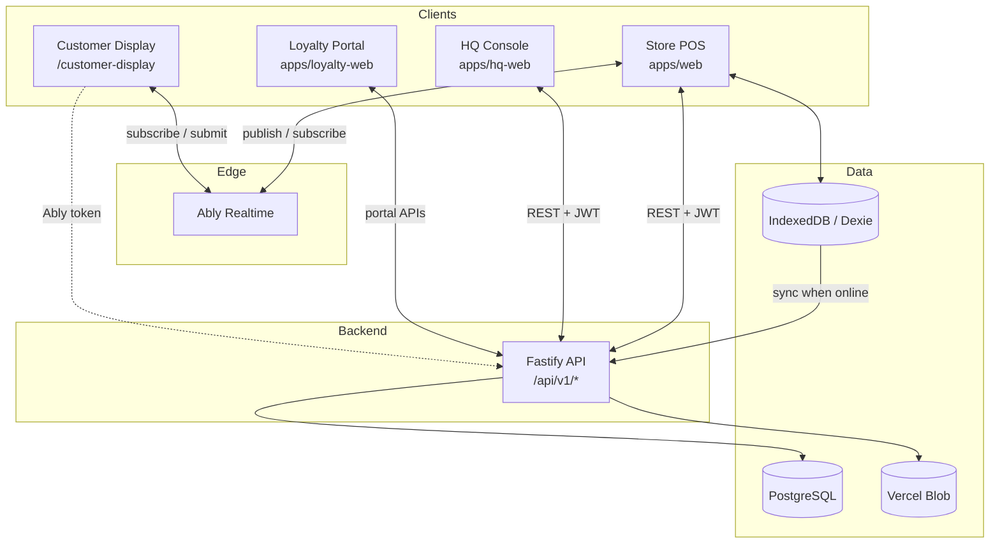
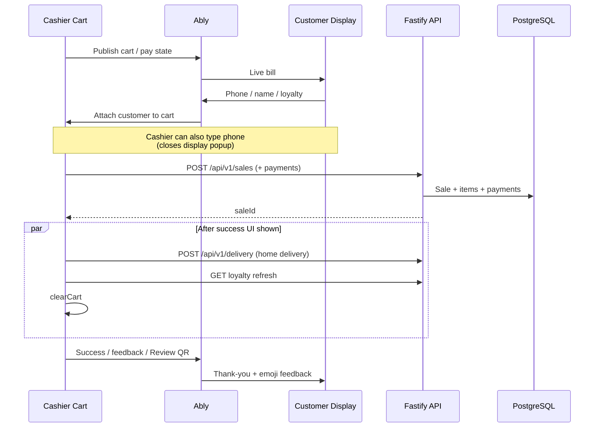
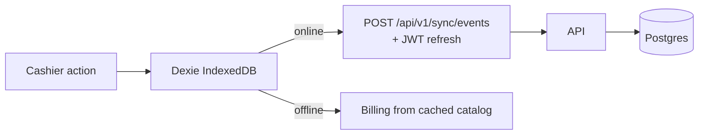
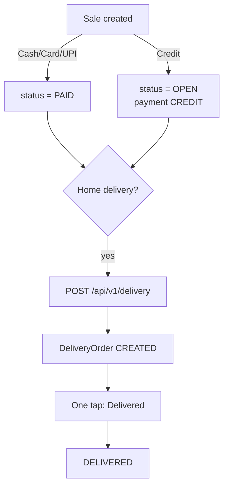
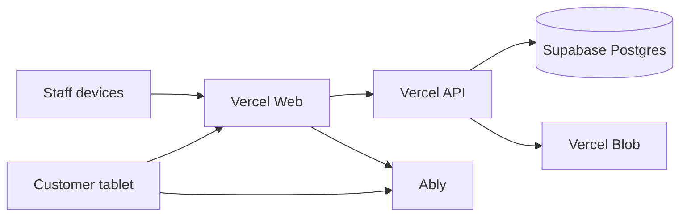

# K2 Chicken POS — Full Documentation

**Scope:** Complete record of the product architecture, tech stack, APIs, and every change built in the Aug 30 – Sep 11, 2026 workstream (customer display → billing speed → delivery → demographics).

**Production (typical):**

| Surface | URL |
|---------|-----|
| Store POS | `https://pos.azeelaai.com` |
| API | `https://k2-chicken-pos-api.vercel.app` |

**Repo:** `K2ChickenPOS` (pnpm monorepo, brand name AzelaPOS / K2 Chicken)

---

## Table of contents

1. [Tech stack](#1-tech-stack)
2. [Monorepo layout](#2-monorepo-layout)
3. [Architecture diagrams](#3-architecture-diagrams)
4. [Roles & main screens](#4-roles--main-screens)
5. [API catalog](#5-api-catalog)
6. [Key data model & business rules](#6-key-data-model--business-rules)
7. [Complete changelog (what we built)](#7-complete-changelog-what-we-built)
8. [APIs & files touched per feature](#8-apis--files-touched-per-feature)
9. [Small details & UX fixes](#9-small-details--ux-fixes)
10. [Ops scripts](#10-ops-scripts)
11. [Deploy notes](#11-deploy-notes)
12. [Commit map](#12-commit-map)
13. [Local development](#13-local-development)

---

## 1. Tech stack

### Frontend — Store (`apps/web`)

| Technology | Use |
|------------|-----|
| **Next.js 15.2** (App Router) | Store POS, cart, delivery, analytics, customer display |
| **React 18** + **TypeScript** | UI |
| **Tailwind CSS** | Styling |
| **Zustand** | Auth, cart, notifications |
| **Axios** | REST client with JWT refresh interceptor |
| **Ably** | Realtime cashier ↔ customer display |
| **Recharts** | Analytics charts |
| **Zod** + React Hook Form | Forms / validation |
| **Dexie** (`@azela-pos/offline`) | IndexedDB offline catalog, cart hold, sync queue |
| **jspdf / html2canvas / react-to-print** | Customer bills, PDFs, print |
| **qrcode / jsbarcode** | Review QR, barcodes |
| **Framer Motion** | Display animations |
| **Radix UI** | Dialog, select, tabs |
| **date-fns** | Dates |
| **lucide-react** | Icons |

### Backend (`apps/api`)

| Technology | Use |
|------------|-----|
| **Node.js 18+** | Runtime |
| **Fastify 4** | HTTP API |
| **Prisma 5** | ORM |
| **PostgreSQL** (Supabase) | Primary database |
| **@fastify/jwt** | Access + refresh tokens |
| **bcryptjs** | Passwords / portal PIN hashes |
| **Zod** (`@azela-pos/shared`) | Request schemas |
| **@fastify/cors** + **rate-limit** | Security |
| **BullMQ + ioredis** | Optional background jobs |
| **@vercel/blob** | Backups / blobs |
| **Vitest** | API tests |

### Other apps

| App | Stack | Port (dev) |
|-----|-------|------------|
| `apps/hq-web` | Next.js 14, React, Recharts, Zustand | 3002 |
| `apps/loyalty-web` | Next.js 15, React, Axios | 3004 |

### Shared packages

| Package | Role |
|---------|------|
| `packages/db` | Prisma schema + client |
| `packages/shared` | Zod schemas, types, store date helpers |
| `packages/offline` | Dexie DB, sync helpers, hold cart, catalog cache |

### Infrastructure

| Piece | Typical host |
|-------|----------------|
| Store web | Vercel → `pos.azeelaai.com` |
| API | Vercel → `k2-chicken-pos-api.vercel.app` |
| Database | Supabase PostgreSQL |
| Realtime | Ably |
| File / backup storage | Vercel Blob (+ Supabase storage scripts) |
| Package manager | **pnpm** 8+ |

---

## 2. Monorepo layout

```
K2ChickenPOS/
├── apps/
│   ├── api/              # Fastify API (/api/v1/*)
│   ├── web/              # Store POS + customer display
│   ├── hq-web/           # Franchise HQ console
│   └── loyalty-web/      # Customer loyalty portal
├── packages/
│   ├── db/               # Prisma
│   ├── shared/           # Shared Zod/types
│   └── offline/          # Dexie offline layer
├── scripts/              # Ops / backfill scripts
└── docs/                 # This documentation
```

---

## 3. Architecture diagrams

### 3.1 System overview



### 3.2 Checkout + customer display flow



### 3.3 Offline sync



### 3.4 Credit → Delivery (fixed)



### 3.5 Production topology



---

## 4. Roles & main screens

### Roles

| Role | Typical access |
|------|----------------|
| **OWNER** | Dashboard, analytics, HQ, all ops |
| **MANAGER** | Store ops, inventory, delivery, reports |
| **CASHIER** | POS, cart, customers, delivery (limited), daily closing |
| **DRIVER** | Delivery jobs |

### Store nav highlights (`apps/web` → `/store/*`)

- Dashboard, POS, Cart, Customers  
- Inventory, Stock ledger, Reconciliation, Wastage, Yield  
- Delivery, Daily closing, Discount approvals, Orders, Pending payments, Purchase orders  
- Reports, ITR/Tax, Analytics, Advanced Analytics, Settings  

### Customer display route

- `/customer-display` — pairing, idle, billing, journey modal, payment, success, feedback, review QR  

---

## 5. API catalog

Base path: **`/api/v1`**

Auth: most routes need `Authorization: Bearer <accessToken>`. Refresh via `POST /api/v1/auth/refresh`.

### 5.1 Auth — `/api/v1/auth`

| Method | Path | Purpose |
|--------|------|---------|
| POST | `/login` | Login |
| POST | `/refresh` | Refresh access token (used by axios + Ably + sync) |
| GET | `/profiles` | Login profile picker |
| POST | `/reset-passwords` | Admin password reset (secret-guarded) |

### 5.2 Products & scale — `/api/v1/products`, `/api/v1/scale`

| Method | Path | Purpose |
|--------|------|---------|
| GET | `/products` | Catalog for POS |
| GET | `/products/categories` | Categories |
| GET | `/products/:id` | Product detail (barcode resolve) |
| * | `/scale/*` | Scale barcode config / parse |

### 5.3 Customers — `/api/v1/customers`

| Method | Path | Purpose |
|--------|------|---------|
| GET | `/customers` | List / search (`q`, `phone`, limit) |
| POST | `/customers` | Create |
| GET | `/customers/:id` | Detail + addresses |
| PUT | `/customers/:id` | Update (display profile apply) |
| DELETE | `/customers/:id` | Delete |
| POST | `/customers/:id/addresses` | Add address |
| GET | `/customers/:id/purchase-history` | History |
| GET | `/customers/:id/loyalty` | Points / tier |
| POST | `/customers/:id/loyalty/redeem` | Redeem |
| POST | `/customers/:id/loyalty/adjust` | Manual adjust |
| POST | `/customers/loyalty/backfill` | Backfill points |
| GET | `/customers/pending-payments` | Credit outstanding |
| POST | `/customers/:id/settle-pending` | Settle multiple open bills |

### 5.4 Sales — `/api/v1/sales`

| Method | Path | Purpose |
|--------|------|---------|
| GET | `/sales` | List (filters: dates, status, paymentMethod, limit) |
| GET | `/sales/dashboard` | Dashboard stats |
| GET | `/sales/:id` | Sale detail |
| POST | `/sales` | **Create sale** (supports optional `payments` for single-call checkout) |
| POST | `/sales/:id/pay` | Add payment / settle |
| POST | `/sales/:id/void` | Void |
| POST | `/sales/:id/refund` | Refund |
| PUT | `/sales/:id` | Edit |
| POST | `/sales/:id/feedback` | Customer emoji / feedback after checkout |

### 5.5 Delivery — `/api/v1/delivery`

| Method | Path | Purpose |
|--------|------|---------|
| POST | `/delivery` | Create delivery for a sale |
| GET | `/delivery` | List (date bounds, status, store scope) |
| PATCH | `/delivery/:id` | Update address / customer details |
| POST | `/delivery/:id/status` | Status change (now often jump straight to `DELIVERED`) |
| POST | `/delivery/:id/assign-driver` | Assign driver |
| POST | `/delivery/:id/otp/verify` | OTP complete |
| GET | `/delivery/driver/my-deliveries` | Driver queue |

**Create rules (after Sep 11 fix):**

- Reject `VOID` / `REFUNDED`
- Allow if sale is **`PAID`**
- **Or** sale is **`OPEN`** with a **`CREDIT`** payment (booked credit)

### 5.6 Analytics — `/api/v1/analytics`

| Method | Path | Purpose |
|--------|------|---------|
| GET | `/sales-overview` | Overview charts |
| GET | `/insights` | Narrative insights |
| GET | `/forecast` | Sales forecast |
| GET | `/demand` | Fast/slow movers |
| GET | `/inventory-recommendations` | Reorder suggestions |
| GET | `/profit-margin` | COGS / margin tracker |
| GET | `/customer-demographics` | **New** — area, loyalty, spend, new vs returning |
| GET | `/sales-trend` | Trend |
| GET | `/top-items` | Top items |
| GET | `/payment-mix` | Payment mix |
| GET | `/time-heatmap` | Heatmap |
| GET | `/alerts` | Analytics alerts |
| GET | `/average-cost/:productId` | Cost |
| GET | `/delivery-kpis` | Placeholder (empty for now) |

Common query params: `startDate`, `endDate`, `franchiseStoreId`.

### 5.7 Sync (offline) — `/api/v1/sync`

| Method | Path | Purpose |
|--------|------|---------|
| POST | `/sync/events` | Push queued Dexie events |
| GET | `/sync/bootstrap` | Bootstrap offline catalog / state |

### 5.8 Customer display — `/api/v1/customer-display`

| Method | Path | Purpose |
|--------|------|---------|
| GET | `/customer-display/token` | Ably TokenRequest (cashier JWT) |
| GET | `/customer-display/customers` | Phone search for display |
| POST | `/customer-display/customers` | Light register from display |

### 5.9 Inventory, PO, reports, HQ, etc.

| Prefix | Purpose |
|--------|---------|
| `/api/v1/inventory` | Stock summary, ledger, reconciliation, wastage |
| `/api/v1/po` | Franchise purchase orders / GRN |
| `/api/v1/reports` | Day-to-day reports |
| `/api/v1/itr` | Tax / ITR |
| `/api/v1/stores` | Stores, franchises, franchise-config |
| `/api/v1/users` | Staff |
| `/api/v1/hq/*` | HQ dashboard, pricing, procurement, royalty, health, fraud, yield, replenishment |
| `/api/v1/discount*` | Discount approvals |
| `/api/v1/daily-closing*` | Daily closing |
| `/api/v1/backup/*` | Backups, storage cleanup, diagnostics |
| `/api/v1/portal/*` | Loyalty portal auth / profile |

### 5.10 Health

| Method | Path | Purpose |
|--------|------|---------|
| GET | `/health` | API health |
| GET | `/` | API name / ok |

---

## 6. Key data model & business rules

### Important models

- **Store**, **User**, **Customer**, **CustomerAddress**
- **Product**, **Category**, **StoreProductPrice**
- **Sale**, **SaleItem**, **Payment**
- **DeliveryOrder**, **DeliveryEvent**
- **InventoryLedger**, **PurchaseOrder**, **GRN**, **Dispatch**
- **SyncEvent**, **AuditLog**, **Shift**
- HQ: pricing, royalty, compliance, health scores, yield intelligence, etc.

### Rules that bit us / we fixed

1. **Credit sales stay `OPEN`**, not `PAID`, until settled in Pending Payments.  
2. **Delivery create** must accept booked credit (`OPEN` + `CREDIT` payment).  
3. **Delivery list** hides walk-in sales with **no customer** (`sale.customerId` required).  
4. **Demographics** has no age/gender fields — uses area, city, loyalty tier, spend, portal flags, new vs returning.  
5. **Home delivery after checkout** is created via `POST /api/v1/delivery` in `checkoutPostSuccess.ts` (non-blocking).

### Delivery statuses (DB enum)

`CREATED` · `READY` · `ASSIGNED` · `OUT_FOR_DELIVERY` · `DELIVERED` · `FAILED` · `RETURNED`

**UI after redesign:** staff mostly see **Open → Delivered** (one tap). Internal statuses still exist in DB.

### Payment methods

`CASH` · `CARD` · `UPI` · `CREDIT` · `ONLINE`

---

## 7. Complete changelog (what we built)

Workstream period: **Sunday Aug 30, 2026 → Thursday Sep 11, 2026**.

### 7.1 Customer Display checkout & loyalty (start)

**Ask:** Customer enters phone on display; registered get loyalty; new register lightly; cashier failsafe; light UI; emoji feedback; phone match dropdown.

**Built:**

1. Customer journey on `/customer-display` (phone → match/register → loyalty → pay → feedback).  
2. Ably sync between cart and display.  
3. Cashier can enter phone/name; display popup closes when cashier types.  
4. Cart still editable while customer fills details.  
5. Hardened profile apply (fixed customer `PUT` 500s).  
6. Light / warm cream UI (not dark).  
7. Minimal registration fields.  
8. Emoji feedback after checkout (`POST /sales/:id/feedback`).  
9. Phone autocomplete dropdown (multiple bugfix rounds).  
10. Unknown number → auto open name/register step.  
11. Payment screens restyled for all modes.  
12. Success screen aligned to warm cream UI.

**Key commits:** `e087790`, `6140e1e`, `7807e06`, `cc29c77`

### 7.2 Review QR from cart

**Ask:** Toggle Review QR from POS cart; normal flow unchanged; new bill resets.

**Built:**

1. Review QR button on cart.  
2. Publishes review screen to customer display via Ably.  
3. New items / new bill exit Review QR back to normal.  
4. Fixed Review QR pin / JWT auth issues.

**Key commits:** `b2c167f`, `7a391cd`

### 7.3 Billing speed

**Ask:** Pay / entire billing too slow.

**Built:**

1. Single-call checkout: `POST /sales` with optional `payments`.  
2. Batched product resolution.  
3. Faster sale number generation.  
4. Shared `applySalePayment` helper.  
5. Post-success side effects moved off critical path (`checkoutPostSuccess.ts`): delivery create, loyalty refresh, clear cart.  
6. Success UI shows sooner.

**Deploy fixes:**

- `dbd6f8a` — `paymentSchema` used before declaration (Vercel TS build).  
- `8142e08` — wrong imports in `applySalePayment` crashed API → whole store offline / CORS; fixed + CORS allowlist for `pos.azeelaai.com`.

**Key commits:** `156c931`, `dbd6f8a`, `8142e08`

### 7.4 Offline sync 401s

**Ask:** `/api/v1/sync/events` returning 401.

**Built:**

1. Sync routed through axios so JWT refresh runs.  
2. Hardened refresh for barcode / Ably token renewal paths.

**Key commits:** `efe0afb`, `7a391cd`

### 7.5 Cart UX bugs

**Ask:** Window jumps after customer entry; accidental Cash Quick Pay.

**Built:**

1. Removed aggressive `scrollIntoView`.  
2. ~450ms click-guard overlay after NumPad/keyboard close.  
3. Ignore Pay / Quick Pay / Ctrl+Enter during guard.  
4. Pads centered so they don’t cover sticky cash bar.

**Key commit:** `7807e06`

### 7.6 Credit bills → Delivery

**Ask:** Credit orders don’t appear in Delivery; backfill historical credit bills.

**Root cause:** Delivery required `PAID`; credit stays `OPEN`.

**Built:**

1. API allows PAID **or** OPEN+CREDIT.  
2. Delivery “create from sale” list loads PAID + OPEN credit sales with customers.  
3. Backfill script created DeliveryOrder rows for outstanding OPEN credit bills.  
4. Checkout still posts delivery after home-delivery pay.

**Key commit:** `b655cb1`  
**Script:** `scripts/backfill-credit-deliveries.ts`

### 7.7 Delivery UI redesign + one-tap complete

**Ask:** Redesign Delivery; why aren’t all deliveries visible?; mark all delivered; don’t dig through multi-step status.

**Built:**

1. Redesigned Delivery page: To do / Done / All; Call / WhatsApp / Map; credit badge; address needed warning.  
2. Search by name, phone, sale #, area.  
3. List + board views.  
4. Fixed “missing” deliveries: defaults were filtering to last 7 days / To do only → fuller defaults + “Show all deliveries”.  
5. Live DB: marked **71** open deliveries as DELIVERED.  
6. Removed Ready → Send out chain; one big **Delivered** button.  
7. Board simplified to Open / Delivered / Failed.

**Key commits:** `b655cb1`, `b078e96`  
**Script:** `scripts/mark-all-deliveries-delivered.ts`

### 7.8 Customer Demographics (Advanced Analytics)

**Ask:** Add demographics page inside Advanced Analytics.

**Built:**

1. `GET /api/v1/analytics/customer-demographics`.  
2. New tab on `/store/analytics/advanced`.  
3. KPIs: total / active / new / repeat / portal / profile / credit.  
4. Charts: by area, revenue by area, loyalty tier, new vs returning, spend bands, named vs walk-in.  
5. Cities from addresses; top customers table; CSV export.  
6. Same date + franchise filters as other tabs.

**Key commit:** `b655cb1`

### 7.9 Repo hygiene

- Stopped tracking local backup artifacts (`02fa1d5`).  
- Performed full backup when requested (ops).

---

## 8. APIs & files touched per feature

### Customer display

| API | Why |
|-----|-----|
| `GET /api/v1/customer-display/token` | Ably auth |
| `GET /api/v1/customer-display/customers` | Phone search |
| `POST /api/v1/customer-display/customers` | Light register |
| `GET/POST/PUT /api/v1/customers*` | Profile apply / loyalty |
| `POST /api/v1/sales/:id/feedback` | Emoji feedback |
| `POST /api/v1/auth/refresh` | Keep Ably/JWT alive |

| Files (representative) |
|------------------------|
| `apps/web/src/app/customer-display/page.tsx` |
| `.../components/{Idle,Billing,Payment,Success,Feedback,Review,CustomerJourney}Screen.tsx` |
| `apps/web/src/lib/customerDisplay/ablyClient.ts` |
| `apps/web/src/lib/customerDisplay/useCustomerProfileInbox.ts` |
| `apps/api/src/routes/customerDisplay.ts` |

### Billing speed

| API | Why |
|-----|-----|
| `POST /api/v1/sales` | Create + optional payments in one call |
| `POST /api/v1/sales/:id/pay` | Fallback / settle path |
| `POST /api/v1/delivery` | After success (async) |
| `GET /api/v1/customers/:id/loyalty` | After success (async) |

| Files |
|-------|
| `apps/api/src/routes/sales.ts` |
| `apps/api/src/utils/applySalePayment.ts` (shared helper) |
| `apps/web/src/lib/checkoutPostSuccess.ts` |
| Cart / POS checkout handlers |

### Sync / auth

| API | Why |
|-----|-----|
| `POST /api/v1/sync/events` | Offline queue flush |
| `GET /api/v1/sync/bootstrap` | Offline bootstrap |
| `POST /api/v1/auth/refresh` | Fix 401s |

| Files |
|-------|
| `apps/web/src/lib/api.ts` (interceptor) |
| `packages/offline/src/sync.ts` |
| `apps/api/src/routes/sync.ts` |

### Delivery + credit

| API | Why |
|-----|-----|
| `POST /api/v1/delivery` | Create (credit allowed) |
| `GET /api/v1/delivery` | List with payments for credit badge |
| `POST /api/v1/delivery/:id/status` | One-tap Delivered |
| `PATCH /api/v1/delivery/:id` | Address / customer details |
| `GET /api/v1/sales?status=PAID` + `status=OPEN&paymentMethod=CREDIT` | Create-from-sale picker |

| Files |
|-------|
| `apps/api/src/routes/delivery.ts` |
| `apps/web/src/app/store/delivery/page.tsx` |
| `scripts/backfill-credit-deliveries.ts` |
| `scripts/mark-all-deliveries-delivered.ts` |

### Demographics

| API | Why |
|-----|-----|
| `GET /api/v1/analytics/customer-demographics` | Tab data |

| Files |
|-------|
| `apps/api/src/routes/analytics.ts` |
| `apps/api/src/services/analyticsService.ts` → `getCustomerDemographics` |
| `apps/web/src/app/store/analytics/advanced/page.tsx` |

---

## 9. Small details & UX fixes

These look minor but mattered on the floor:

| Detail | Why it mattered |
|--------|-----------------|
| Phone match dropdown stay-open after pad closes | List was untappable |
| `onPointerDown` for match rows | Clicks were flaky vs blur |
| Unknown 10-digit phone → name step | Staff don’t hunt for “register” |
| Cashier typing closes display modal | Avoid dual input fight |
| ~450ms overlay after pad close | Stopped ghost-click Cash Quick Pay |
| No `scrollIntoView` after customer set | Stopped cart jump / mis-taps |
| NumPad/keyboard centered | Not covering sticky cash bar |
| Review QR resets on new bill | Display doesn’t stick on review forever |
| Delivery empty-state “Show all” | Staff thought orders were deleted |
| Credit badge on delivery cards | See credit vs paid at a glance |
| “Address needed” amber card | Incomplete home deliveries obvious |
| Success screen cream UI | Matched payment/feedback look |
| Post-checkout side effects async | Pay button no longer “stuck” |
| CORS for `pos.azeelaai.com` | Browser blocked API after crash deploy |
| Delivery list filters named customers only | Walk-ins without customer stay off board |

---

## 10. Ops scripts

### `scripts/backfill-credit-deliveries.ts`

- Finds OPEN credit sales with customer and no DeliveryOrder.  
- Dry-run by default; `--apply` writes rows.  
- Used to recover credit home-delivery bills that never entered Delivery.

```bash
cd packages/db
pnpm exec tsx ../../scripts/backfill-credit-deliveries.ts           # dry-run
pnpm exec tsx ../../scripts/backfill-credit-deliveries.ts --apply   # write
```

### `scripts/mark-all-deliveries-delivered.ts`

- Marks every non-DELIVERED DeliveryOrder as DELIVERED.  
- Ran once on production (71 rows).  

```bash
cd packages/db
pnpm exec tsx ../../scripts/mark-all-deliveries-delivered.ts --apply
```

---

## 11. Deploy notes

1. **API and Web must both deploy** for features that touch both (billing speed, credit→delivery, demographics).  
2. A broken API import once made the **entire store look offline** — always verify `/health` after API deploys.  
3. Shared package build order matters (`paymentSchema` must be declared before use).  
4. Customer display needs working Ably token endpoint + valid cashier JWT refresh.  
5. After credit→delivery API change, new credit home-delivery checkouts create Delivery rows; old ones needed the backfill script.

---

## 12. Commit map

| Commit | Summary |
|--------|---------|
| `e087790` | Harden customer display checkout flow |
| `6140e1e` | Customer Display changes |
| `02fa1d5` | Stop tracking local backup artifacts in git |
| `b2c167f` | Cart Review QR + faster checkout success UX |
| `efe0afb` | Fix offline sync 401s via axios auth refresh |
| `7a391cd` | Fix Review QR pin + JWT refresh for barcode scans |
| `156c931` | Speed up billing — single-call checkout + batching |
| `dbd6f8a` | Fix shared build — `paymentSchema` declaration order |
| `8142e08` | Fix API crash from broken `applySalePayment` imports |
| `7807e06` | Phone flow + stop accidental cash pay on cart |
| `cc29c77` | Align customer display success screen (warm cream) |
| `b655cb1` | Demographics + credit→delivery + Delivery UI redesign |
| `b078e96` | One-tap Delivered + show full order list |

---

## 13. Local development

```bash
pnpm install
cp .env.example .env   # set DATABASE_URL, JWT secrets, API URL, Ably keys, etc.
pnpm db:generate
pnpm db:migrate
pnpm db:seed
pnpm dev               # API + web (and other packages as configured)
```

| Service | Port |
|---------|------|
| Store web | 3000 |
| API | 3001 |
| HQ web | 3002 |
| Loyalty web | 3004 |

Seeded test phones (see root README): Owner `9999999999`, Manager `8888888888`, Cashier `7777777777`, Driver `6666666666`.

---

## Appendix A — Customer display screens

| Component | Role |
|-----------|------|
| `PairingScreen` | Pair display to store/cashier session |
| `IdleScreen` | Waiting for cart activity |
| `BillingScreen` | Live cart / totals |
| `CustomerJourneyModal` | Phone / name / loyalty journey |
| `CustomerInfoPanel` | Editable fields on display |
| `PaymentScreen` | Payment mode waiting UI (all methods) |
| `SuccessScreen` | Thank-you (warm cream) |
| `FeedbackScreen` | Emoji feedback |
| `ReviewScreen` | Google / review QR |

---

## Appendix B — Advanced Analytics tabs

1. Sales Overview  
2. Profit Margin  
3. Sales Forecast  
4. Demand Analysis  
5. Inventory Recommendations  
6. Insights  
7. **Customer Demographics** (added)

Shared controls: start/end date, franchise filter (owner), Refresh, Export CSV.

---

## Appendix C — End-to-end mental model

```
POS Cart ──Ably──► Customer Display (phone / loyalty / pay / feedback / Review QR)
   │
   ├── Fast Pay → POST /sales (+ payments) → success UI
   │                 └── background: delivery + loyalty + clearCart
   │
   ├── Home delivery (+ credit OK) → DeliveryOrder → one-tap Delivered
   │
   └── Offline → Dexie → POST /sync/events (with JWT refresh)

Owner → Advanced Analytics → Customer Demographics
```

---

*Document generated from the Aug 30 – Sep 11, 2026 workstream. Update this file when shipping the next major feature batch.*
